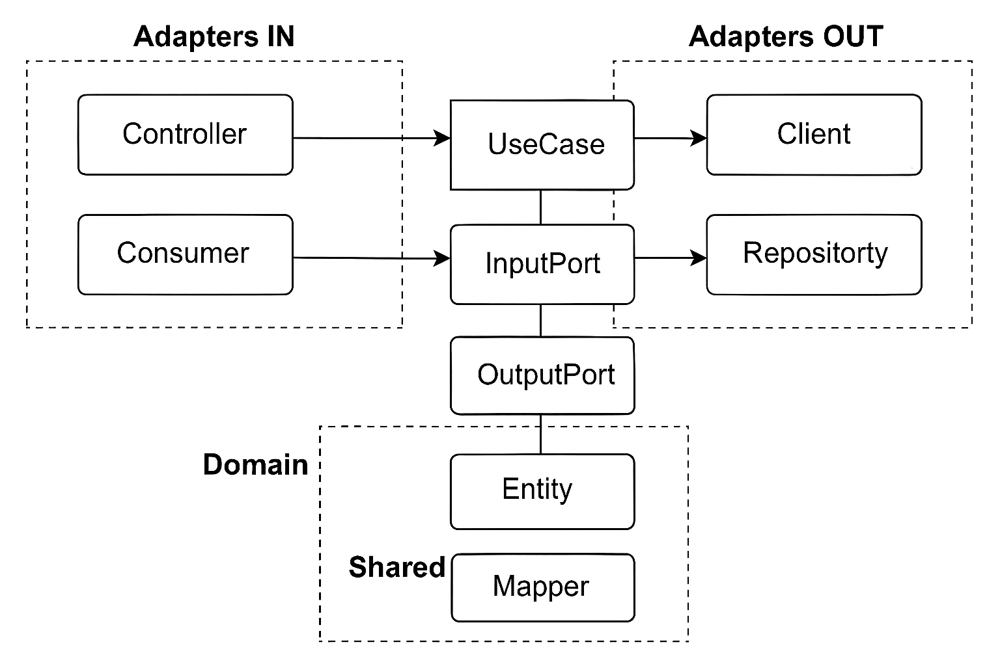

# Arquitetura Hexagonal + ArchUnit

  [Visualizar diagrama online](https://brauliosassi.github.io/cursos-backend/architecture-diagram.png)

> Garantindo coerência estrutural e de nomenclatura em um projeto Java seguindo princípios da Arquitetura Hexagonal.



---
## 🔍 Visão Geral
Este projeto demonstra como aplicar testes de arquitetura com [ArchUnit](https://www.archunit.org/) para manter limites claros entre:
- Camada de domínio (regras de negócio)
- Portas (interfaces de entrada e saída)
- Adaptadores (entrada: HTTP/Messaging | saída: Client/Repository)

Os testes evitam que dependências indevidas e violações de convenções se propaguem à medida que o código cresce.

---
## 🧱 Estrutura de Pacotes (simplificada)
```
com.bsassi.hexagonal
├── HexagonalApplication
├── adapters
│   ├── in
│   │   ├── controller
│   │   └── consumer
│   └── out
│       ├── client
│       └── repository
├── application
│   ├── core
│   │   ├── domain
│   │   └── usecase
│   └── ports
│       ├── in
│       └── out
└── config
```

---
## 🏷️ Convenções de Nomenclatura
| Tipo        | Pacote esperado                              | Sufixo obrigatório       |
|-------------|-----------------------------------------------|--------------------------|
| Controller  | adapters.in.controller                        | Controller               |
| Consumer    | adapters.in.consumer                          | Consumer                 |
| Client      | adapters.out.client                           | Client                   |
| Repository  | adapters.out.repository                       | Repository               |
| UseCase     | application.core.usecase                      | UseCase                  |
| Input Port  | application.ports.in                          | InputPort (interface)    |
| Output Port | application.ports.out                         | OutputPort (interface)   |
| Entity      | application.core.domain / repository.entity   | Entity (opcional)        |
| Mapper      | mapper pacotes específicos                    | Mapper / MapperImpl      |

As regras são verificadas via testes ArchUnit para garantir aderência contínua.

---
## ✅ O que é Validado
Principais aspectos cobertos pelos testes:
1. Classes estão no pacote correto conforme seu papel.
2. Seguem os sufixos definidos na tabela acima.
3. Domínio não referencia adaptadores nem frameworks externos indevidos.
4. Portas de saída não dependem diretamente de camadas de entrada.
5. Mappers centralizam conversões entre camadas.

---
## 🧪 Executando Testes
Gradle:
```bash
./gradlew test
```
Relatório: build/reports/tests/test/index.html

---
## 📐 Arquivo de Configuração
Estrutura e convenções parametrizadas em:
```
archunit-structure.yml
```
Edite para ajustar pacotes ou sufixos sem alterar diretamente os testes.

---
## 🧩 Exemplo de Regra ArchUnit (conceito)
```java
classes()
  .that().resideInAPackage("..adapters.in.controller..")
  .should().haveSimpleNameEndingWith("Controller");
```
Outras regras: naming, isolamento de domínio, dependências entre portas e adaptadores.

---
## 🚀 Como Adicionar um Novo Caso de Uso
1. Domínio: adicionar entidades ou valores em `application.core.domain`.
2. UseCase: criar classe em `application.core.usecase` terminando com `UseCase`.
3. Portas: definir interfaces em `application.ports.in` (entrada) e `application.ports.out` (saída).
4. Adaptador: implementar porta de saída em `adapters.out.*` com sufixo adequado.
5. Controller/Consumer: expor funcionalidade em `adapters.in.controller` ou `adapters.in.consumer`.
6. Mapper: se necessário, criar em pacote mapper correspondente.
7. Rodar `./gradlew test` para validar arquitetura.

---
## ♻️ Boas Práticas
- Domínio isolado: sem dependências de Spring, HTTP ou infraestrutura.
- Comunicação sempre via portas (interfaces) e adaptadores concretos.
- Nomes explícitos e consistentes para facilitar testes automatizados.
- Evitar lógica de negócio em adaptadores.

---
## 🛠️ Ferramentas
| Stack | Uso |
|-------|-----|
| Java / Gradle | Build e execução |
| ArchUnit | Testes de arquitetura |
| JUnit 5 | Framework de testes |

---
## 📊 Métricas & Relatórios
Abra `build/reports/tests/test/index.html` após os testes para detalhes de execução.

---
## 📎 Referências
- https://www.archunit.org/
- Ports & Adapters (Alistair Cockburn)
- Clean Architecture (Robert C. Martin)

---
## 🗂️ Diagrama
Ver `docs/architecture-diagram.png`.

---
## 📝 Licença
Uso educacional / interno.

---
Mantido para estudos de arquitetura limpa e evolução sustentável.
